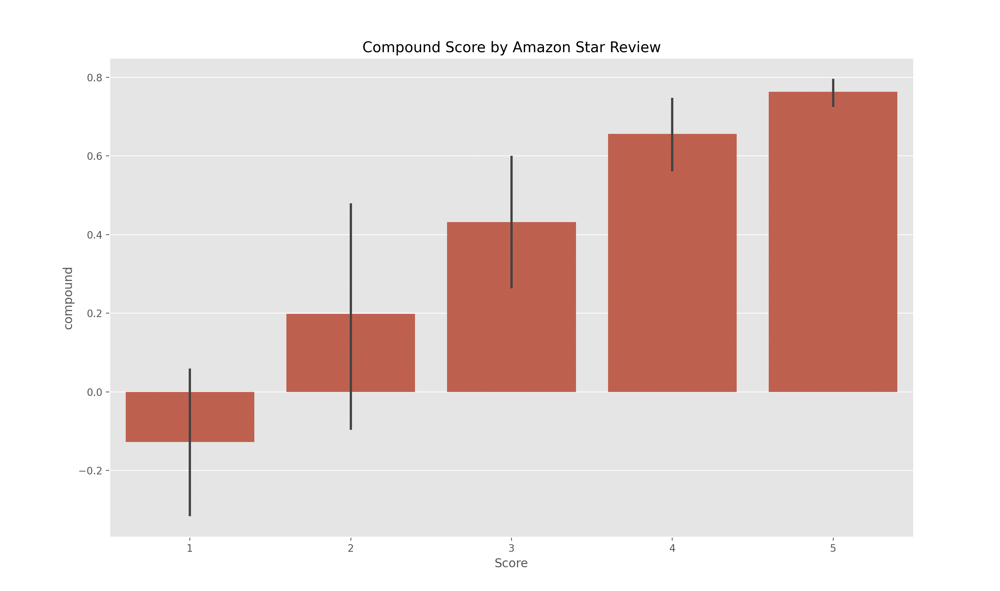
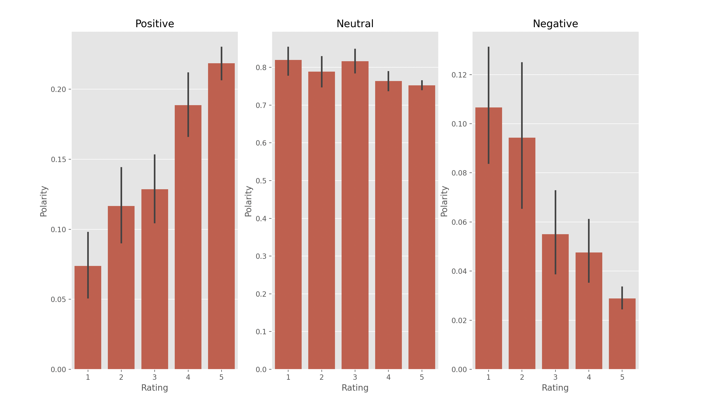

## Project : Sentiment Analysis Amazon Reviews

<p>
  
  
</p>

### Table of contents :

1. Problem statement
2. Compatible configurations.
3. Installing packages.
4. Steps.
5. Conclusion

## 1. Problem statement :

In this project we are conducting a sentiment analysis using two NLP methods :
* VADER  (Valence Aware Dictionary and Sentiment Reasoner) - Bag of words approach 
* RoBERTa (Robustly optimized BERT approach) - Pretrained model 

This analysis is based on a dataset of Amazon fine food reviews.

## 2. Compatible configurations :

* Python 3
* Windows 10
* MacOS
* Linux

## 3. Installing packages :
This program uses the following Python libraries :

```
certifi 2024.2.2
charset-normalizer 3.3.2
click 8.1.7
contourpy 1.2.1
cycler 0.12.1
filelock 3.14.0
fonttools 4.51.0
fsspec 2024.5.0
huggingface-hub 0.23.1
idna 3.7
Jinja2 3.1.4
joblib 1.4.2
kiwisolver 1.4.5
MarkupSafe 2.1.5
matplotlib 3.9.0
mpmath 1.3.0
networkx 3.3
nltk 3.8.1
numpy 1.26.4
packaging 24.0
pandas 2.2.2
pillow 10.3.0
pprintpp 0.4.0
pyparsing 3.1.2
python-dateutil 2.9.0.post0
pytz 2024.1
PyYAML 6.0.1
regex 2024.5.15
requests 2.32.2
safetensors 0.4.3
scipy 1.13.1
seaborn 0.13.2
six 1.16.0
sympy 1.12
tokenizers 0.19.1
torch 2.2.2
tqdm 4.66.4
transformers 4.41.1
typing_extensions 4.12.0
tzdata 2024.1
urllib3 2.2.1

```

## 4. Steps :

### The different steps : 

  * Loading the data
  * Quick EDA
  * Basic NLTK
  * VADER : Sentiment Scoring
  * RoBERTa : Pre-trained Model
  * Compare scores between models
  * Review Examples

## 5. Conclusion :

  * Overall, both VADER and RoBERTa models are effective and produce similar values that are
  consistent with the review scoring, except for some discrepancies between the results and the 
  review scores.
  * Moreover, by comparing these two models, it turns out that RoBERTa seems more accurate in 
  handling nuanced sentiments and context-dependent expressions, whereas VADER is faster and less 
  resource-intensive.
  * Finally, future improvements such as using a larger dataset or incorporating more features 
  would enhance the model performance.

---